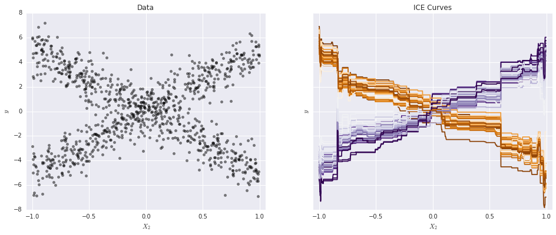

# ⬛ PyCEbox
Python Individual Conditional Expectation Plot Toolbox

A Python implementation of individual conditional expecation plots inspired by R's [ICEbox](https://cran.r-project.org/web/packages/ICEbox/index.html). Individual conditional expectation plots were introduced in _Peeking Inside the Black Box: Visualizing Statistical Learning with Plots of Individual Conditional Expectation_ ([arXiv:1309.6392](http://arxiv.org/abs/1309.6392)).

## Quickstart

The [tutorial](https://github.com/AustinRochford/PyCEbox/blob/master/notebooks/PyCEBox%20Tutorial.ipynb) recreates the first example in the above paper using `pycebox`.

For easy development and prototyping using IPython notebooks, a Docker environment is included.  To run an IPython notebook with access to your development version of `pycebox`, run `PORT=8889 sh ./start_container.sh`.  A Jupyter notebook server with access to your development version of `pycebox` should be available at `http://localhost:8889/tree`.

To run the `pycebox`'s tests in your development container

1. Access a bash shell on the container with `docker exec -it pycebox bash`.
2. Change to the `pycebox` directory with `cd ../pycebox`
3. Run the tests with `pytest test/test.py`

## Documentation

For details of `pycebox`'s API, consult the [documentation](http://austinrochford.github.io/PyCEbox/docs/).

## License

This library is distributed under the [MIT License](https://raw.githubusercontent.com/AustinRochford/PyCEbox/master/LICENSE).
